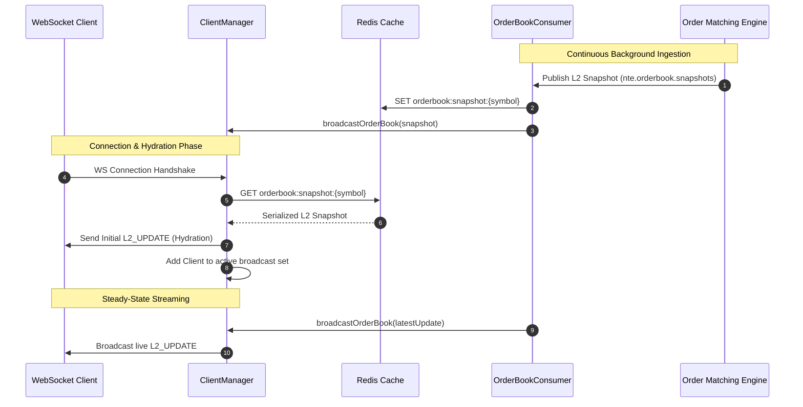

# State Hydration & L2 Snapshot Caching

In the [[summaries/market-data-gateway-overview|Market Data Gateway (MDG)]], **state hydration** is the mechanism by which newly connected WebSocket clients receive a full baseline Level 2 (L2) order book snapshot before receiving live incremental updates. 

Because market data consumers need an accurate view of resting liquidity immediately upon establishing a connection, the MDG utilizes an in-memory caching tier powered by [[entities/redis-cache|Redis]] to serve low-latency snapshot hydration without placing query load on upstream services like the [[entities/order-matching-engine|Order Matching Engine]].

---

## 1. The Cold-Start Challenge

Streaming market data over WebSockets involves continuous delta publications (`L2_UPDATE` and `TRADE_TICK` events) as described in [[concepts/data-lifecycle|Data Lifecycle]] and [[concepts/websocket-broadcasting|WebSocket Broadcasting]]. However, a client establishing a connection mid-stream faces the "cold-start" problem:

1. **Missing Initial State**: Incremental depth events and trade ticks are context-dependent; an order book cannot be constructed from deltas alone without an initial baseline of bids and asks.
2. **Upstream Protection**: Querying the [[entities/order-matching-engine|Order Matching Engine]] directly on every client connection handshake would degrade core execution performance and violate the principles of [[concepts/ingestion-egress-decoupling|Ingestion-Egress Decoupling]].
3. **Synchronization Timing**: If a client receives real-time broadcast deltas while waiting for a snapshot, out-of-order application can lead to a corrupted local order book.

---

## 2. Hydration Architecture & Caching Mechanism

To solve this, MDG uses a sidecar caching strategy governed by [[decisions/redis-l2-state-caching|Architectural Decision: Redis L2 State Caching]].

```
                                +---------------------------+
                                | `Order Matching Engine` |
                                +---------------------------+
                                              |
                                              | (nte.orderbook.snapshots)
                                              v
+-----------------------+       +---------------------------+
| `Redis Cache`       | <---- |   `OrderBookConsumer`   |
| (L2 Snapshot Storage) |       +---------------------------+
+-----------------------+                     |
            | (Read Snapshot)                 | (Live Broadcast)
            v                                 v
+-----------------------------------------------------------+
|                     `ClientManager`                     |
+-----------------------------------------------------------+
            |                                 |
            | 1. Hydrate Snapshot             | 2. Stream Live Deltas
            v                                 v
   [New WS Client]                  [Active WS Clients]
```

### Cache Write Path (Continuous Ingestion)
1. The upstream matching engine publishes periodic aggregated L2 snapshots to the Kafka topic `nte.orderbook.snapshots`.
2. The [[entities/order-book-consumer|OrderBookConsumer]] consumes these records under consumer group `mdg-orderbook-group`.
3. Ingested snapshots are parsed using the [[entities/protobuf-contracts|Protobuf]] schema `nte.marketdata.OrderBookSnapshot`.
4. The latest snapshot for each market symbol is written asynchronously to [[entities/redis-cache|Redis]] under key `orderbook:snapshot:<symbol>`.

### Cache Read Path (Client Connection Hydration)
1. An external client establishes a TCP/WebSocket handshake with [[entities/client-manager|ClientManager]].
2. Upon connection establishment (`wss.on('connection')`), the gateway initiates hydration for the client's subscribed symbols.
3. The latest L2 snapshot is fetched from [[entities/redis-cache|Redis]].
4. The gateway dispatches the snapshot enveloped as an `L2_UPDATE` payload directly to the client's socket.
5. The socket is added to the active broadcast set (`this.clients.add(ws)`) to begin receiving continuous fan-out updates.

---

## 3. Hydration Workflow Sequence



---

## 4. Contract and Data Schema

Hydration payloads use the contract models defined in [[entities/protobuf-contracts|Protobuf Contracts]] and [[entities/runtime-models|Runtime Models]].

### Internal Protobuf Wire Structure
```protobuf
message OrderBookSnapshot {
    string symbol = 1;
    repeated Level bids = 2;
    repeated Level asks = 3;
    int64 timestamp_ns = 4;
}

message Level {
    double price = 1;
    double quantity = 2;
    int32 order_count = 3;
}
```

### JSON Egress Hydration Envelope
When transmitted over the WebSocket client connection by [[entities/client-manager|ClientManager]], the snapshot is wrapped in the standard egress envelope:

```json
{
  "type": "L2_UPDATE",
  "data": {
    "symbol": "BTC-USD",
    "bids": [
      { "price": 64500.50, "quantity": 1.254, "orderCount": 4 },
      { "price": 64500.00, "quantity": 3.890, "orderCount": 12 }
    ],
    "asks": [
      { "price": 64501.00, "quantity": 0.850, "orderCount": 2 },
      { "price": 64501.50, "quantity": 2.100, "orderCount": 5 }
    ],
    "timestamp": 1718000000000
  }
}
```

---

## 5. Concurrency & Ordering Guarantees

* **Monotonic Timestamps**: Each snapshot contains `timestamp_ns` generated by the [[entities/order-matching-engine|Order Matching Engine]]. Client applications use this field to discard stale or duplicate updates if a live broadcast arrives concurrently with hydration data.
* **Non-Blocking Ingestion**: The state caching path does not block the primary broadcast channel, aligning with the performance requirements outlined in [[decisions/low-latency-egress-design|Low-Latency Egress Design]].
* **Downstream Independence**: Hydration is isolated to client ingress and does not affect the data feeds consumed by [[entities/compliance-surveillance-monitor|Compliance Surveillance Monitor]] or [[entities/trade-settlement-system|Trade Settlement System]].

---

## 6. Related Documentation

* [[index]] — System-wide architecture and component relationships
* [[decisions/redis-l2-state-caching]] — Rationale for choosing Redis for snapshot hydration
* [[concepts/websocket-broadcasting]] — Implementation of connection pooling and message fan-out
* [[entities/client-manager]] — WebSocket lifecycle and broadcast execution details
* [[entities/order-book-consumer]] — Ingestion pipeline for Level 2 book updates